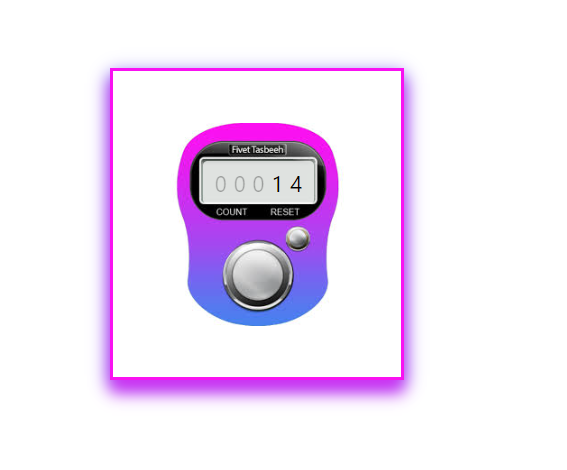

The Counter component in React allows users to increment and reset a five-digit counter, always displaying leading zeros. Key features include conditional opacity styling for zeros, smooth visual transitions, and a gradient background. Hover effects add a blurred shadow for visual appeal, providing a clear and responsive interface for tracking counts.

<a>
  
</a>

## Getting Started

These instructions will help you set up and run the project on your local machine for development and testing purposes.

### Prerequisites

Make sure you have the following installed on your system:

- Node.js (v14.x or later)
- npm (v6.x or later) or yarn (v1.x or later)
- Git

### Installation

1. **Clone the repository**:
    ```bash
    git clone https://github.com/NigarFatima2009/Counter-app.git
    cd Counter-app
    ```

2. **Install dependencies**:
    If you are using npm:
    ```bash
    npm install
    ```
    Or if you are using yarn:
    ```bash
    yarn install
    ```

### Running the Project

1. **Start the development server**:
    If you are using npm:
    ```bash
    npm start
    ```
    Or if you are using yarn:
    ```bash
    yarn start
    ```

2. **Open your browser and navigate to**:
    ```
    http://localhost:3000
    ```

    This will open the application in development mode.


https://github.com/user-attachments/assets/085a858a-e8b0-46ea-b056-f11407359a4e

